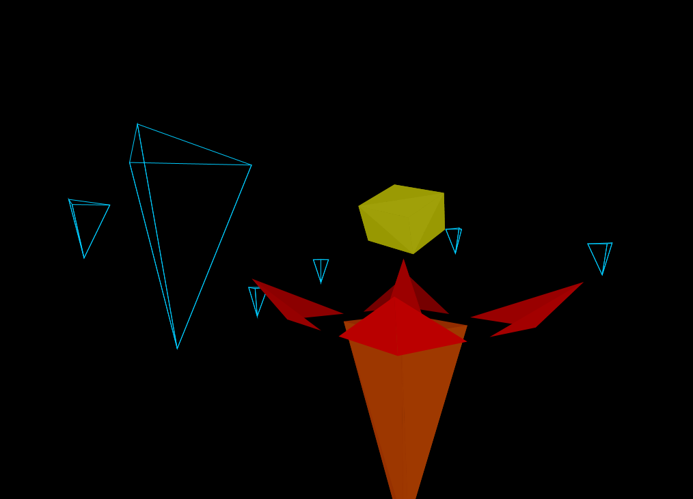

# Renderer

A real-time rasterization-based software 3D renderer.



The renderer renders a world consisting of objects, which in turn consist of triangles. The objects can have arbitrary shapes and colors and they can be solid or wireframe meshes.

The camera can be moved around and rotated in real-time.

## Controls

* W, A, S, D: move camera forwards, backwards and sideways
* Q, Z: move camera upwards and downwards
* Arrow keys: rotate camera

## Level format

The program loads the world from a text file called *world* located in the same directory as the program.

The structure of the file should be as follows:
```
<camera X> <camera Y> <camera Z> // camera starting position in world space
<n: number of objects>
(repeat n times)
  <X> <Y> <Z> // current object center in world space
  <material> <color R> <color G> <color B> <color A> // material SOLID/WIREFRAME, color in range [0..255]
  <m: number of triangles in current object>
  (repeat m times)
    <t1x> <t1y> <t1z> <t2x> <t2y> <t2z> <t3x> <t3y> <t3z> // triangle vertex coordinates in object space
```


## Building the project

The project can be built using Eclipse Scala IDE 4.7.0.
